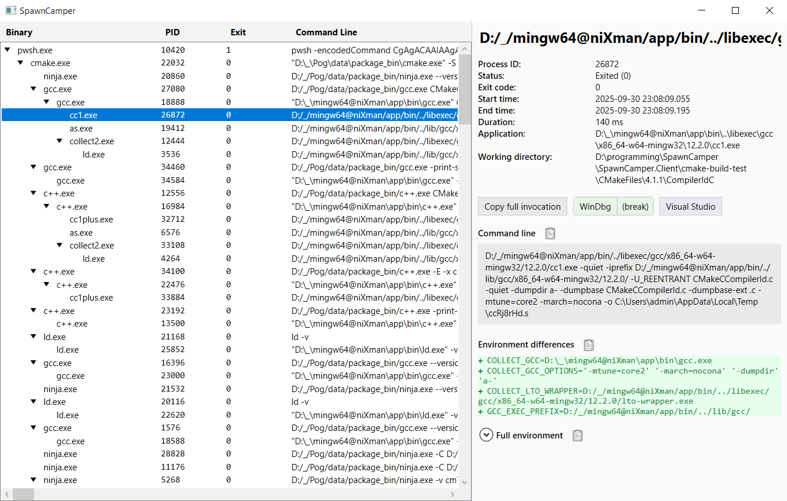

# SpawnCamper

A simple Windows-only tool that shows full invocations of all processes that were invoked in a specific tree, including command line, working directory and environment variables, and allows you to easily re-run a specific process under a debugger.

The took works by first spawning a named pipe server (written in C#) and then running the top-level process with an injected [Detours](https://github.com/microsoft/Detours/) hook. The hook connects to the server and dumps information from hooked Win32 functions and replicates itself into child processes by hooking `CreateProcess`.

---

**Disclaimer:** The hook itself (the C++ part) and the parser on the server side were written by hand, and should be pretty solid. The GUI was vibecoded with a somewhat minimal understanding of the WPF implementation, since I don't really enjoy implementing UIs – it seems to work, but it's fairly plausible that it'll fall apart at the first edge case.

---



## Usage

There are two ways to run SpawnCamper:

1. Invoke `launcher.ps1` from PowerShell, pass the command to invoke as arguments:
   ```pwsh
   .\bin\launcher.ps1 cmd /c exit
   ```
   The launcher ensures that the server is running and then calls `SpawnCamper.exe` and forwards all arguments.

2. Manually launch the GUI server by calling `.\bin\server\SpawnCamper.Server.exe`, then run the actual traced process by calling `.\bin\SpawnCamper.exe`, passing the command line to invoke.